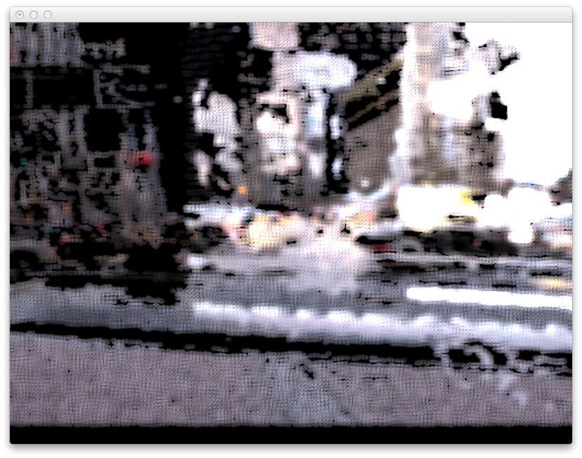

# grainField

*grainField* is a tool for VJ (video jockey), mixes movie files, synchronize
visual effects to the sounds and separate pixels into point cloud.

You can use a keyboard, MIDI devices and OSC cliant applications as controller.

## Screenshot

## Execution environment
Current release was tested only Mac OS X.

## Requirements
grainField depends on openFrameworks and other libraries.
* openFramewoks
  <http://www.openframeworks.cc/>
* ofxMidi
  <https://github.com/danomatika/ofxMidi>
* json-c
  <https://github.com/json-c/json-c>
* FFTW 3
  <http://www.fftw.org/>

It is necessary to buid json-c and FFTW 3 on your Mac's Terminal, like bellow.
`CFLAGS="-arch i386" LDFLAGS="-arch i386" ./configure --enable-static=yes`

## Execution

Put some movies into the 'bin/data/movies' folder and run grainField.app.
Key assignments are described in 'testApp.cpp'.
You can quit this application with pressing ESC or Command+Q keys.

## Licesne
Copyright (c) 2013 Akihiro Komori

Permission is hereby granted, free of charge, to any person obtaining a copy of
this software and associated documentation files (the "Software"), to deal in
the Software without restriction, including without limitation the rights to
use, copy, modify, merge, publish, distribute, sublicense, and/or sell copies
of the Software, and to permit persons to whom the Software is furnished to do
so, subject to the following conditions:

The above copyright notice and this permission notice shall be included in all
copies or substantial portions of the Software.

THE SOFTWARE IS PROVIDED "AS IS", WITHOUT WARRANTY OF ANY KIND, EXPRESS OR
IMPLIED, INCLUDING BUT NOT LIMITED TO THE WARRANTIES OF MERCHANTABILITY,
FITNESS FOR A PARTICULAR PURPOSE AND NONINFRINGEMENT. IN NO EVENT SHALL THE
AUTHORS OR COPYRIGHT HOLDERS BE LIABLE FOR ANY CLAIM, DAMAGES OR OTHER
LIABILITY, WHETHER IN AN ACTION OF CONTRACT, TORT OR OTHERWISE, ARISING FROM,
OUT OF OR IN CONNECTION WITH THE SOFTWARE OR THE USE OR OTHER DEALINGS IN THE
SOFTWARE.

## Acknowledgment
Special thanks to everyone concerned.
* openFrameworks community members.
* Yasushi Okumura as editorial supervisor.
